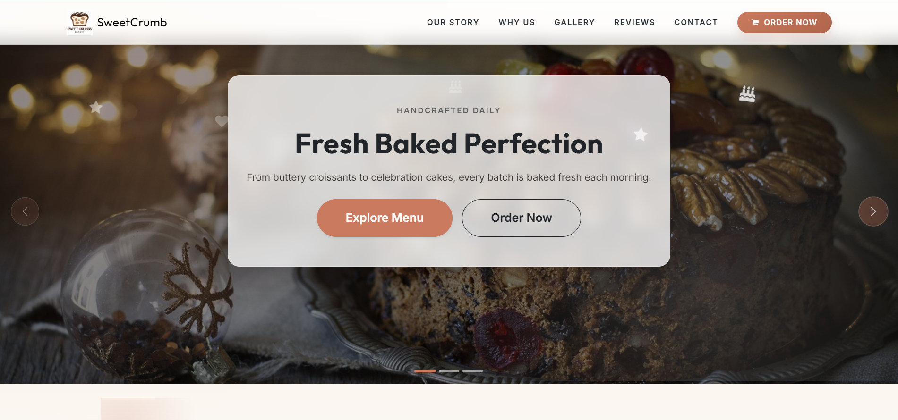
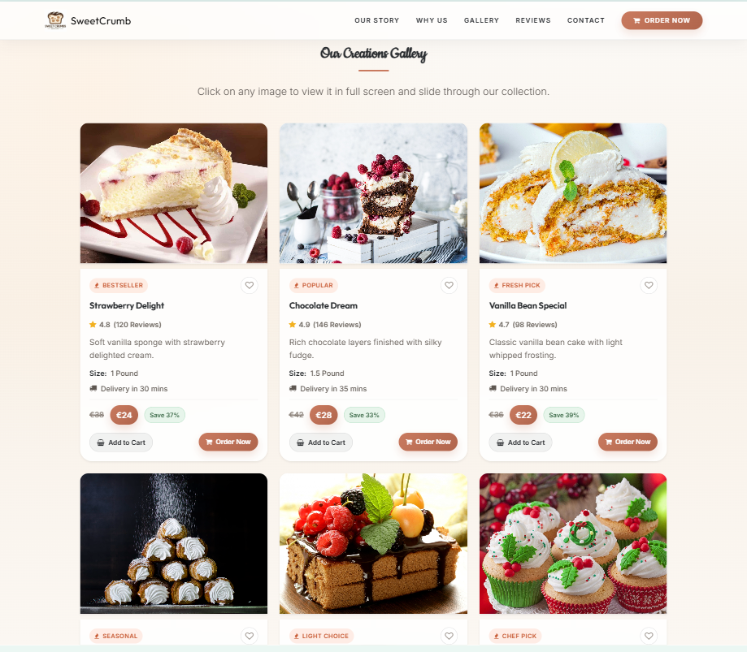
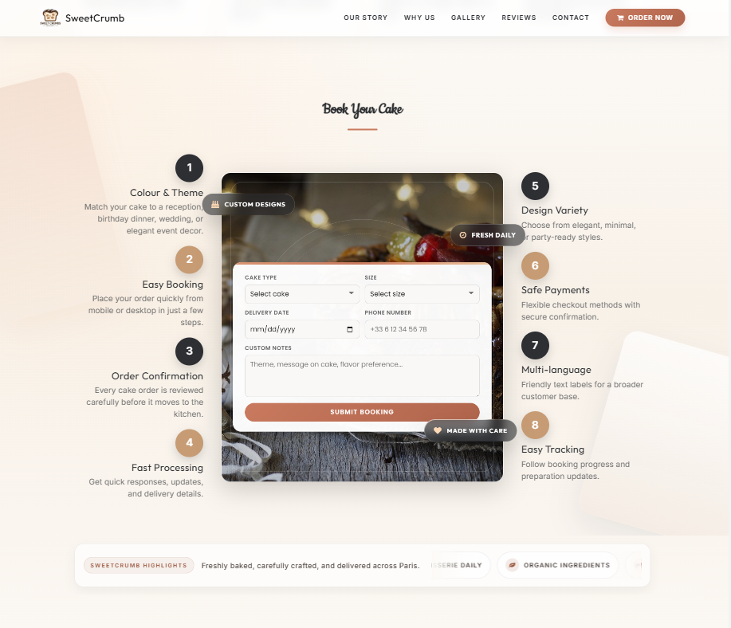

# 🍰 SweetCrumb Bakery Website

A beautifully designed bakery website built using **HTML, CSS, JavaScript, and Bootstrap**.  
SweetCrumb showcases delicious treats, elegant UI, and a smooth user experience—perfect for a modern patisserie brand.

---

## 🌐 Live Demo

👉 [Live Demo](https://sweetcrumb-bakery-website.netlify.app/){:target="_blank"}

---

## 📸 Screenshots





---

## ✨ Features

- 🍪 Responsive design (mobile-friendly)
- 🎂 Elegant bakery-themed UI
- 🖼️ Image gallery with Lightbox
- 🎯 Smooth animations using GSAP
- 🧁 Menu and product showcase sections
- 📞 Contact and styled footer section
- ⚡ Fast loading with CDN-based libraries

---

## 🛠️ Tech Stack

- **HTML5**
- **CSS3**
- **JavaScript (ES6)**
- **Bootstrap 5**
- **GSAP (animations)**
- **Lightbox2**
- **Font Awesome**

---

## 📂 Project Structure

```text
bakery/
├── index.html
├── README.md
├── .gitignore
├── assets/
│   ├── fonts/
│   │   └── font-awesome.min.css
│   └── img/
│       ├── Screenshot1.png
│       ├── Screenshot2.png
│       ├── Screenshot3.png
│       ├── cake1.jpg ... cake18.jpg
│       └── sweetcrumblogo.webp
├── js/
│   └── main.js
└── style/
    └── css/
        ├── styles.css
        └── Pretty-Footer-.css
```

---

## 🚀 Getting Started

### 1. Clone the repository

```bash
git clone https://github.com/NavHamid/sweetcrumb-bakery-website.git
```

### 2. Open the project

Simply open `index.html` in your browser  
or use Live Server in VS Code for the best experience.

---

## 💡 Future Improvements

- 🛒 Add online ordering system
- 🔐 User login/signup
- 📊 Admin dashboard
- 🌍 Backend integration (Node.js / Firebase)

---

## 🤝 Contributing

Contributions are welcome.  
Feel free to fork this repository and submit a pull request.

---

## 📄 License

This project is shared for educational and portfolio use.  
You can add an MIT License file if you want it fully open-source.

---

## 💖 Acknowledgements

- Bootstrap for responsive UI
- GSAP for animations
- Lightbox for image gallery
- Font Awesome for icons

---

## 👨‍💻 Author

**Hamid**  
GitHub: [https://github.com/NavHamid](https://github.com/NavHamid)

---


